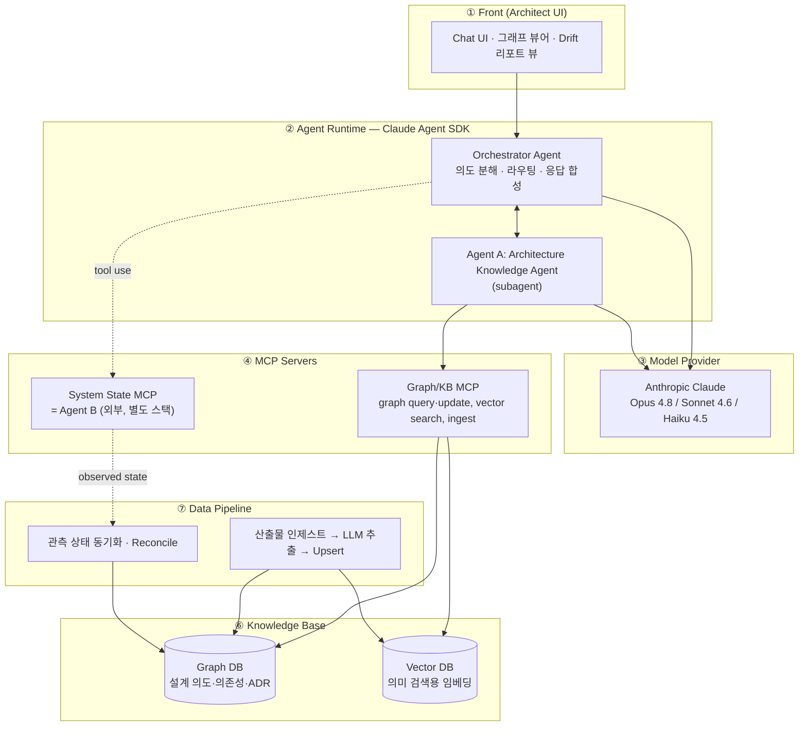
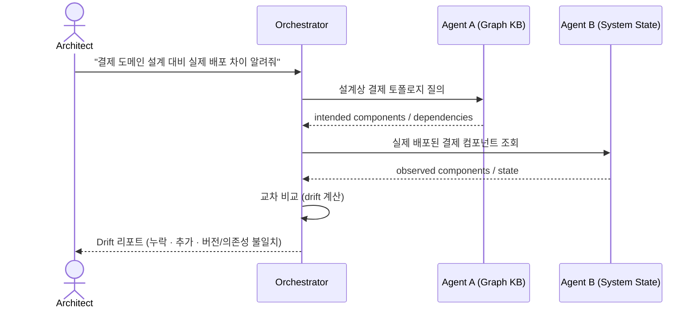
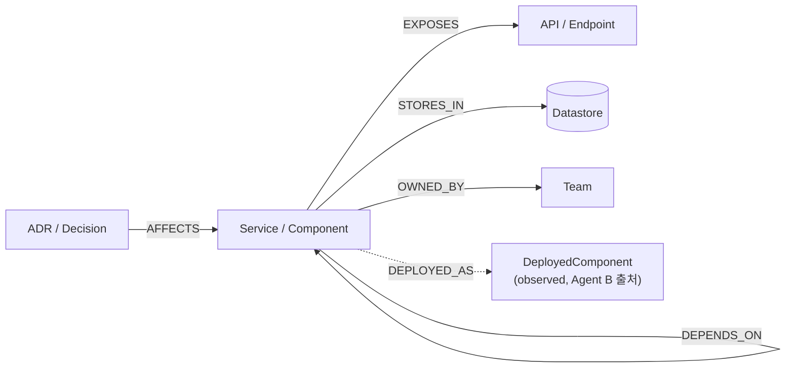
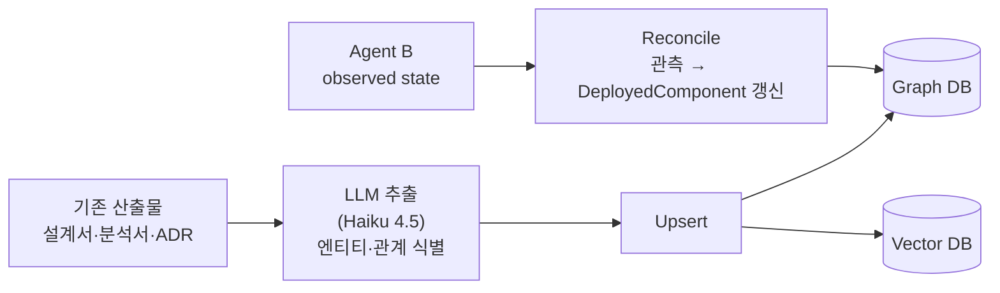
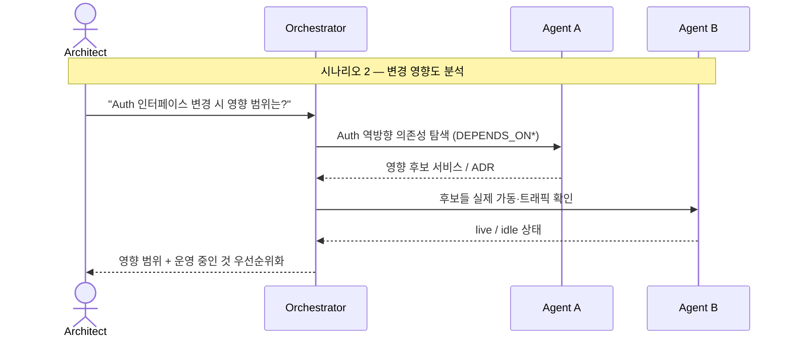
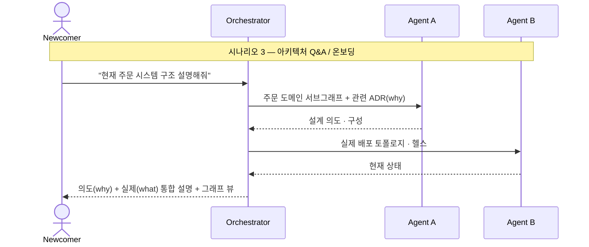

# 산출물 ② — Agent 아키텍처 구성도

> 프로젝트: **archiagent** / 자매 문서: `01-product-brief.md`
> 스택: **Claude Agent SDK**. Agent B(시스템 상태)는 외부 팀이 별도 스택으로 제작 → 본 문서는 **연계 계약(MCP)** 으로만 다룬다.

---

## 0. 전체 구성도

---

## 1. Front 구성

- **형태:** 아키텍트용 채팅 인터페이스(웹) — 자연어 질의 입력, 답변/리포트 출력. PoC에서는 단순 챗 UI 또는 CLI로 충분.
- **뷰 3종:**
  - 대화 뷰 — 질의/응답
  - **그래프 뷰** — Agent A의 서브그래프 시각화(컴포넌트·의존성)
  - **Drift 리포트 뷰** — 설계 vs 실제 비교 결과(추가/누락/불일치)
- **책임 분리:** Front는 표현만. 모든 추론·조합은 Runtime이 담당.

---

## 2. Agent Runtime 구성 (Claude Agent SDK)

### 2.1 Orchestration 부문
- **Orchestrator Agent** = SDK `query()` 루프의 진입점.
  - 사용자 의도 분해 → 어떤 시나리오인지 판별(drift / 영향도 / Q&A).
  - **Agent A는 subagent**로 호출(설계 지식), **Agent B는 MCP tool**로 호출(실제 상태).
  - 두 결과를 합성해 최종 응답 생성.
  - **정지 조건:** 시나리오별 최대 반복 횟수, 도구 호출 실패 시 graceful degrade(B 불가 시 설계만으로 답).
  - **휴먼 체크포인트:** 그래프 *쓰기/갱신* 같은 비가역 작업은 `AskUserQuestion`으로 확인.

### 2.2 Agent Instruction · Prompt
- **Orchestrator 시스템 프롬프트:** 역할(아키텍트 보조), 시나리오 라우팅 휴리스틱, "설계는 Agent A·실제는 Agent B" 도구 사용 규칙, 비가역 작업 시 확인 규칙.
- **Agent A 시스템 프롬프트:** 그래프 데이터 모델(노드/엣지 종류)·질의 패턴, "추측 금지, 그래프에 없으면 없다고 답", 응답은 `concise|detailed` 스위치 지원.
- 설계 원칙은 `CLAUDE.md` §5(Harness Engineering)를 따른다.

---

## 3. Model Provider

| 용도 | 모델 | API ID |
|------|------|--------|
| Orchestrator 추론·합성, 영향도 분석 | **Opus 4.8** (기본) | `claude-opus-4-8` |
| 라우틴 질의·요약 | Sonnet 4.6 | `claude-sonnet-4-6` |
| 산출물에서 엔티티 추출(대량·저비용) | Haiku 4.5 | `claude-haiku-4-5-20251001` |

> 모델별 선택 근거는 `CLAUDE.md` §6 표 참조. PoC 기본값은 Opus 4.8 단일로 시작 후, 비용 민감 단계만 하향.

---

## 4. MCP Server

| MCP | 제공 | 주요 도구 |
|-----|------|-----------|
| **Graph/KB MCP** | 우리 구현 (Agent A 백엔드) | `kb_graph_query`, `kb_graph_upsert`, `kb_vector_search`, `kb_ingest_doc` |
| **System State MCP** | **= Agent B (외부)** | `state_get_topology`, `state_get_component`, `state_list_running` |

**System State Contract (Agent B 연계 계약, 스택 무관):**
- `state_get_topology(domain)` → 실제 배포된 컴포넌트·의존성 그래프
- `state_get_component(name)` → 버전·헬스·트래픽 등 상태
- `state_list_running()` → 가동 중 컴포넌트 목록

> Agent B 미완성 동안에는 이 계약을 만족하는 **모킹 MCP**로 대체해 시나리오를 시연한다.

---

## 5. Tools (도구 설계)

명명은 `kb_*`(지식) / `state_*`(상태)로 prefix를 분리해 에이전트가 "설계용/실제용"을 구분하게 한다.

| 도구 | 소속 | 설명 |
|------|------|------|
| `kb_graph_query` | Agent A | 그래프 패턴/의존성 탐색(예: 역방향 `DEPENDS_ON*`) |
| `kb_graph_upsert` | Agent A | 노드·엣지 생성/갱신 (비가역 → 확인) |
| `kb_vector_search` | Agent A | 자연어 의미검색으로 관련 노드/문서 청크 검색 |
| `kb_ingest_doc` | Pipeline | 기존 산출물 인제스트 트리거 |
| `state_*` | Agent B | 위 계약 3종 |
| `drift_compare` | Orchestrator | 설계 그래프 vs 관측 상태 비교 → 추가/누락/불일치 |

> 도구 응답은 토큰 효율을 위해 ID를 의미 라벨로 해소하고, 큰 결과는 `concise|detailed`·페이지네이션 지원. 실패 시 "어떻게 고쳐 부를지" 알려주는 에러 메시지(§CLAUDE.md 도구 설계 원칙).

---

## 6. Knowledge Base

### 6.1 Graph DB — 설계 의도·의존성·ADR
예: Neo4j 류. 데이터 모델:

- **노드:** Service/Component, API, Datastore, Team, ADR(결정·why), DeployedComponent(관측값)
- **엣지:** `DEPENDS_ON`, `EXPOSES`, `STORES_IN`, `OWNED_BY`, `AFFECTS`, `DEPLOYED_AS`
- 설계 노드와 관측 노드(`DeployedComponent`)를 분리 저장 → drift 비교의 기반.

### 6.2 Vector DB — 의미 검색
예: pgvector/Qdrant 류. 산출물 문서 청크·노드 설명의 임베딩 저장 → "결제 관련 컴포넌트" 같은 자연어 질의를 그래프 진입점으로 변환.

---

## 7. Data Pipeline

1. **인제스트:** 기존 문서 → LLM으로 엔티티/관계 추출 → 그래프·벡터에 Upsert. (문서 → 그래프 전환의 1회성/주기성 단계)
2. **Reconcile:** Agent B의 관측 상태를 주기적으로 받아 `DeployedComponent` 노드를 갱신. → drift를 항상 최신으로 유지(시나리오 4의 기반).

---

## 8. 시나리오 시퀀스 (요약)

---

## 9. 미정/후속 결정 (Open Questions)

- Graph DB / Vector DB 제품 선정 (Neo4j vs 대안, pgvector vs Qdrant)
- Front 형태(웹 챗 vs CLI) 확정
- Agent B 연계 계약의 상세 스키마 — 외부 팀과 합의 필요
- 인제스트 대상 산출물 포맷 범위(Markdown/Confluence/PPT 등)
